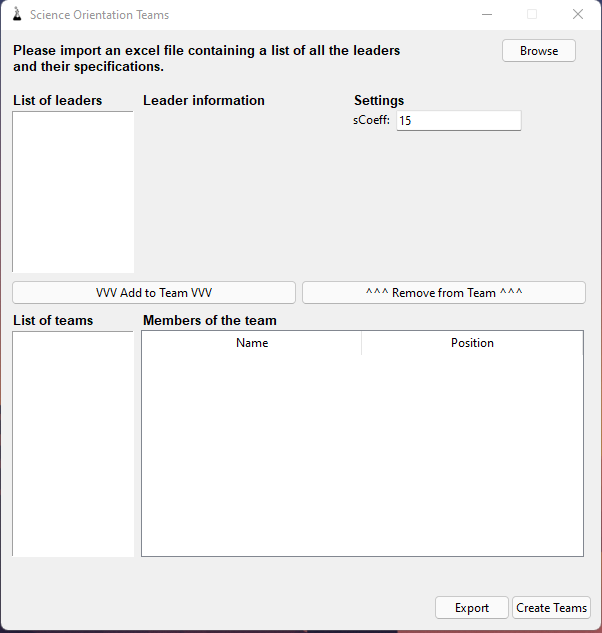
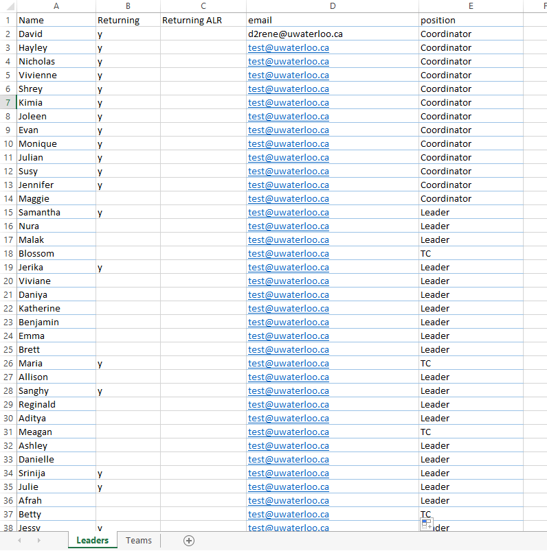
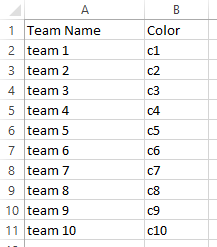

# Orientation-Teams

Automatic creation of teams originally designed for University of Waterloo's Science Orientation. This tool allows for random and fair generation of teams as well as manual modifications through the user interface. It is important to be able to make manual modifications to the teams that are generated by this tool and this was kept in mind throughout the development.

## Usage
To use this app, you must first download this repository. You can do that by either clicking "Code", then "Download ZIP", or by running:
```
$ git clone https://github.com/dreneuw/Orientation-Teams.git
```
If you download the ZIP, you will need to unzip it.

Once this is done, you can run this application by going in the "dist" folder and running the executable named "**teams.exe**".

Here is a view of the user interface that will pop up:


The first step is to import the excel file containing the list of leaders. You can do so by pressing the browse button in the top right, then selecting the location of the file. The excel file **must have two sheets, Leaders and Teams**. The Leaders sheet must look as such:



And the Teams sheet must look like:




 David René
 davrene11@gmail.com
 d2rene@uwaterloo.ca
