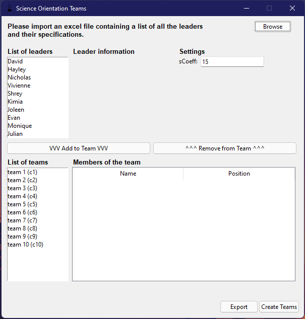
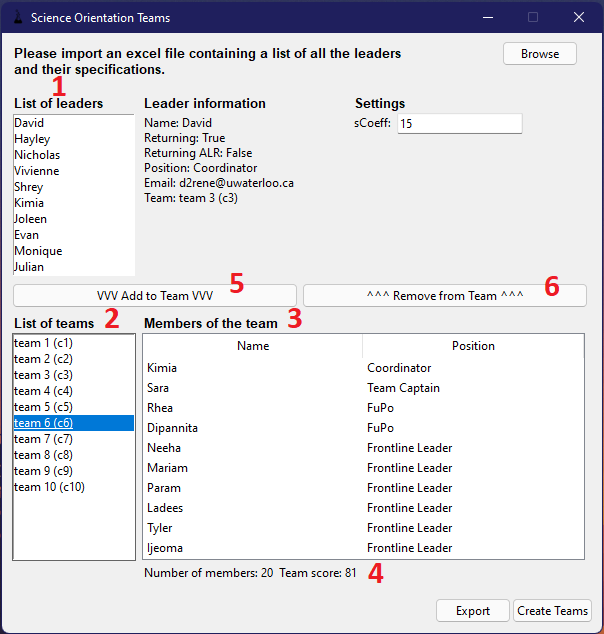

# Orientation-Teams

Automatic creation of teams originally designed for University of Waterloo's Science Orientation. This tool allows for random and fair generation of teams as well as manual modifications through the user interface. It is important to be able to make manual modifications to the teams that are generated by this tool and this was kept in mind throughout the development.

## Usage
To use this app, you must first download this repository. You can do that by either clicking "Code", then "Download ZIP", or by running in terminal:
```
$ git clone https://github.com/dreneuw/Orientation-Teams.git
```
If you download the ZIP, you will need to unzip it.

Once this is done, you can run this application by going in the "dist" folder and running the executable named "**teams.exe**".

Here is a view of the user interface that will pop up:


The first step is to import the excel file containing the list of leaders. You can do so by pressing the browse button in the top right, then selecting the location of the file. The excel file **must have two sheets, Leaders and Teams**. The Leaders sheet must look as such:


And the Teams sheet must look like:


At this stage, if the excel file is correct and it has been imported, the user interface will look as such:



Clicking on the "Create Teams" button will create random and fair teams based on the sCoeff given as well as the leader list and teams list provided. Once teams have been created, the user can see leader information by clicking on any leader from the "List of leaders" **(1)**. Users can also see who is in what team by selecting a team from the "List of teams" **(2)**. The information will appear under "Members of the team" **(3)**. Once a team is selected, additional information is displayed under the "Members of the team" view **(4)**.



In order to make manual modifications to a team, one can select a leader from list of leader, a team from the list of teams and click "Add to Team" **(5)** to add the selected leader to the selected team. This process will overwrite the current team of the leader. You can also select a team from the list of teams, then select a leader from the members of the selected team and click "Remove from Team" **(6)** to remove any member of a team.

Finally, the user can click "Export" to select a folder to export the result to. The result of exporting is a text file containing all the information of each team (list of team members, who is team captain, coordinator, etc., team email list) as well as a few useful email lists for the Team Captains of each team and FuPos of each team.

Here is a video tutorial on how to use this tool:

[](https://www.youtube.com/watch?v=FMihaaJrmJc)

# Development

If you want to add features to this project, please clone this repository and create a pull request. The entirety of the code is located in **teams.py**. This code requires a working version of python as well as numpy and py2exe.

# Build

You can build this tool into an executable by:

```
cd Orientation-Teams
python setup.py py2exe
```

Once this has run, an executable named **teams.exe** will be created in the dist folder that contains the changes you have made to the code.

# Feature Ideas
- Adding more settings to the tool. The scoring system of leaders could be added to the UI to be modified by the user. The option to ignore coordinators and not add them to any team should also be added.
- A method to search from the List of leaders or to filter them.
- A way to import an already created result file in order to make modifications to a list of teams that were already generated.
- Polishing the results file: this could mean making the results file an excel file with better presentation rather than a text file. Alternatively, the results could be saved another way (JSON, etc.) and the tool could have a second view where the user can see the results, copy email lists, etc.
- Making an in-tool emailing system. This tool could be used to import an email format and use it to email any email list given.

# Annexe
- **FuPo**: Fun police, a role in Science Orientation.
- **ALR**: Additional Leader Role (Team Captain or FuPo).
- **Frontline leader**: Frontline leaders (or FLL) are leaders who are not ALRs.
- **Scoring system**: Each leader is scored by their attributes. The base score of a leader is 3. If they are a returning leader, they get an additional 3 points, if they are a returning ALR, they get an additional 3 points. The max score of a leader is 9.
- **sCoeff setting**: Each team has a total score, which is the sum of the score of each leader. When making fair teams, the tool will attempt making fair teams until the difference between any two given teams is less than sCoeff. A low sCoeff will result in the tool having difficulty making fair teams. It is recommended to keep the sCoeff setting to 15, which it is set to by default.
- **Team making system**: The tool works by brute force: it will attempt making random teams in a way that is fair (equal distribution) until all teams respect the sCoeff setting. In addition, teams can not have a difference of more than 1 member between any two given team. The tool will start by evenly distributing Coordinators, then evenly distributing Team Captains, then evenly distributing FuPos and finally evenly distributing frontline leaders. If this distribution does not fit the score criteria as well as the number of members criteria, it will reattempt from the start. The tool makes a maximum of 100 attempts, which takes approximately 1-2s to run. This way, the user can not "soft lock" the tool.


 David René
 davrene11@gmail.com
 d2rene@uwaterloo.ca
